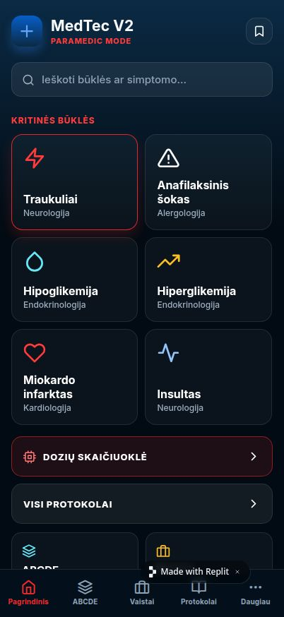
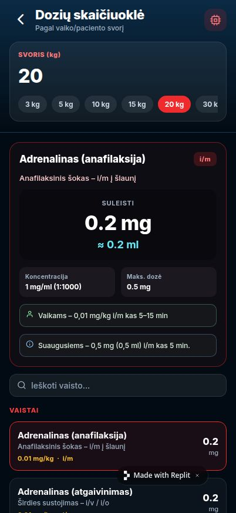

# MedTec V2 – Paramedic Mode 🚑

Mobili Expo (React Native) aplikacija Lietuvos greitosios medicinos pagalbos paramedikams.

## Ekranai

| Pagrindinis | Dozių skaičiuoklė |
|---|---|
|  |  |

## Funkcijos

- **12 pagalbos protokolų** lietuvių kalba (traukuliai, anafilaksija, MI, insultas, astma, plaučių edema, meningitas ir kt.)
- **ABCDE vertinimas** – pirminio vertinimo algoritmas su SAMPLE anamneze
- **Vaistų sąrašas** – 22 vaistai su dozėmis, indikacijomis ir kategorijomis
- **Dozių skaičiuoklė** – automatinis dozavimas pagal svorį (kg):
  - Tikslios dozės (mg / ml / VV)
  - Maksimalios dozės ribos su įspėjimu
  - Skiedimo instrukcijos (pvz. „1 ml adrenalino + 9 ml NaCl = 10 ml (1:10 000)")
  - Greiti svorio mygtukai (3–70 kg)
  - 17 vaistų: adrenalinas, diazepamas, midazolamas, morfinas, penicilinas, MgSO₄, amiodaronas ir kt.
- **Tamsi tema** – navy fonas (`#020B13`), raudonas akcentas (`#EF2B2D`)
- **Greitieji numeriai** – 112, Apsinuodijimų kontrolės centras

## Technologijos

- [Expo](https://expo.dev/) / React Native
- [Expo Router](https://expo.github.io/router/) – failų pagrindu maršrutizavimas
- [expo-linear-gradient](https://docs.expo.dev/versions/latest/sdk/linear-gradient/)
- [@expo-google-fonts/inter](https://github.com/expo/google-fonts)
- TypeScript · pnpm workspaces (monorepo)

## Diegimas

```bash
git clone https://github.com/idejaveikti-hue/v2.git
cd v2
pnpm install
pnpm --filter @workspace/medic-app run dev
```

Tada nuskenuokite QR kodą su [Expo Go](https://expo.dev/client) programa telefone.

## Projekto struktūra

```
artifacts/medic-app/
├── app/
│   ├── (tabs)/
│   │   ├── index.tsx          # Pagrindinis ekranas
│   │   ├── abcde.tsx          # ABCDE vertinimas
│   │   ├── vaistai.tsx        # Vaistų sąrašas
│   │   ├── protokolai.tsx     # Visi protokolai
│   │   └── daugiau.tsx        # Papildoma / įrankiai
│   ├── protocol/[id].tsx      # Protokolo detalės (4 sub-tabai)
│   └── skaiciuokle.tsx        # Dozių skaičiuoklė
├── data/
│   ├── protocols.ts           # 12 pagalbos protokolų
│   ├── drugs.ts               # Vaistų sąrašas
│   ├── doseCalc.ts            # Skaičiuoklės duomenys ir logika
│   └── abcde.ts               # ABCDE + SAMPLE žingsniai
├── components/
│   └── ProtocolIcon.tsx       # Protokolų ikonos
└── constants/
    └── colors.ts              # MedTec V2 spalvų paletė
```

## ⚠️ Atsakomybės atsisakymas

Ši aplikacija – **TIK mokomasis įrankis**. Visada vadovaukitės oficialiais galiojančiais protokolais ir klinikiniu mąstymu prieš priimdami sprendimus dėl gydymo.

---
*MedTec V2 – sukurta Lietuvos GMP paramedikams*
